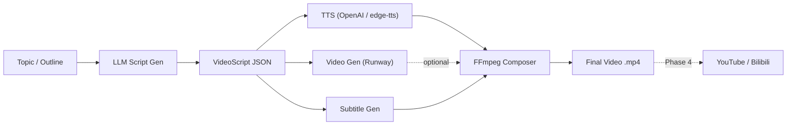

# AI Video Pipeline

[](https://www.python.org/downloads/)
[](https://ffmpeg.org/)
[](#license)

> AI-driven video production pipeline: topic → structured script → TTS & video assets → composed video → multi-platform publish.

## Table of Contents

- [Introduction](#introduction)
- [Features](#features)
- [Quick Start](#quick-start)
- [Architecture](#architecture)
- [Configuration](#configuration)
- [CLI Reference](#cli-reference)
- [Changelog](#changelog)
- [License](#license)

## Introduction

AI Video Pipeline automates the entire video creation workflow. Given a topic or outline, it uses an LLM to generate a structured storyboard script, synthesizes narration audio via TTS, generates AI video clips, composes everything with transitions and subtitles using FFmpeg, and outputs a ready-to-publish video file.

The system is designed around a **pluggable architecture** — each stage (text generation, TTS, video generation, publishing) is defined by an abstract interface, making it straightforward to swap providers (e.g. OpenAI ↔ edge-tts, Runway ↔ Kling) without changing the pipeline logic.

## Features

### Implemented (Phase 1–3)

- **LLM Script Generation** — Converts a topic into a structured JSON storyboard (scenes with narration, visual prompts, transitions) via OpenAI-compatible APIs (GPT-4o, DeepSeek, etc.)
- **TTS Audio Synthesis** — Two providers:
  - **OpenAI TTS** (tts-1 / tts-1-hd)
  - **edge-tts** (free, Microsoft Edge online TTS, no API key required)
- **AI Video Clip Generation** — Runway ML Gen API (gen4.5 text-to-video, gen3a_turbo image-to-video); gracefully skips if unconfigured
- **SRT Subtitle Generation** — Auto-generated from script with actual TTS audio durations for precise timing
- **FFmpeg Video Composition**
  - Per-scene preparation: scale/pad to target resolution, audio mux, solid-colour fallback when no video clip
  - Transitions: fade, crossfade, wipe, dissolve, slide, cut
  - Hard-sub subtitle burning
  - Multi-resolution support (16:9, 9:16, 1:1)
- **Typer CLI** — `generate-script`, `generate-video`, `compose`, `run` (full pipeline), `version`
- **YAML + Pydantic Config** — Type-safe configuration with `.env` support for secrets

### Planned

- **Phase 4** — YouTube & Bilibili publishers (OAuth2, retry, status tracking)
- **Phase 5** — Batch tasks, checkpoint resume, Tauri desktop GUI

## Quick Start

### Prerequisites

- **Python** 3.11+
- **FFmpeg** on PATH ([install guide](https://ffmpeg.org/download.html))
- **API Key** for at least one LLM provider (OpenAI, DeepSeek, etc.)

### Installation

```bash
# Create conda environment (recommended)
conda create -n videopipeline python=3.11 -y
conda activate videopipeline

# Install with all optional dependencies
pip install -e ".[all,dev]"
```

### Environment Setup

Copy `.env.example` to `.env` and fill in your API keys:

```bash
cp .env.example .env
```

```dotenv
OPENAI_API_KEY=sk-your-key-here
OPENAI_BASE_URL=https://api.deepseek.com   # optional, for compatible APIs
RUNWAYML_API_SECRET=rml_your-key-here       # optional, for AI video clips
```

### Usage

```bash
# Generate a video script from a topic
videopipeline generate-script "三分钟了解量子计算"

# Generate assets (TTS audio + video clips + subtitles) from a script
videopipeline generate-video output/scripts/script.json

# Compose final video from assets
videopipeline compose output/scripts/script.json

# Or run the full pipeline in one command
videopipeline run "三分钟了解量子计算" -v
```

## Architecture

```
ai-videopipeline/
├── src/videopipeline/
│   ├── cli.py                # Typer CLI entry point
│   ├── config.py             # YAML + Pydantic + .env config loader
│   ├── pipeline.py           # Orchestration engine (stages 1–4)
│   ├── models/
│   │   └── script.py         # VideoScript / Scene data models
│   ├── generators/
│   │   ├── text.py           # LLM script generation (OpenAI-compatible)
│   │   ├── audio.py          # TTS providers (OpenAI, edge-tts)
│   │   ├── video.py          # Video providers (Runway ML)
│   │   └── subtitle.py       # SRT subtitle generation
│   ├── assembler/
│   │   └── composer.py       # FFmpeg composition engine
│   ├── publishers/
│   │   ├── base.py           # Abstract publisher interface
│   │   ├── youtube.py        # YouTube (Phase 4)
│   │   └── bilibili.py       # Bilibili (Phase 4)
│   └── utils/
│       ├── ffmpeg.py          # FFmpeg subprocess wrapper
│       └── storage.py         # Workspace / artifact manager
├── config/
│   └── default.yaml           # Default configuration
└── output/                    # Generated artifacts (gitignored)
```



## Configuration

All settings live in `config/default.yaml`, with secrets loaded from `.env`:

| Variable | Description | Default |
|----------|-------------|---------|
| `openai.model` | LLM model name | `deepseek-chat` |
| `tts.provider` | TTS engine (`openai` \| `edge-tts`) | `edge-tts` |
| `tts.edge_voice` | edge-tts voice name | `zh-CN-XiaoxiaoNeural` |
| `video_gen.provider` | Video generation backend | `runway` |
| `video_gen.model` | Runway model | `gen4.5` |
| `output.resolution` | Output video resolution | `1920x1080` |
| `output.aspect_ratio` | Aspect ratio (`16:9` \| `9:16` \| `1:1`) | `16:9` |
| `composition.transition_duration` | Transition overlap in seconds | `0.5` |
| `pipeline.language` | Narration language (`zh` \| `en`) | `zh` |
| `pipeline.concurrent_tasks` | Max parallel generation tasks | `3` |

Environment variable overrides: `OPENAI_API_KEY`, `OPENAI_BASE_URL`, `OPENAI_MODEL`, `RUNWAYML_API_SECRET`.

## CLI Reference

| Command | Description |
|---------|-------------|
| `videopipeline generate-script <topic>` | Generate a structured video script via LLM |
| `videopipeline generate-video <script.json>` | Generate TTS audio, video clips, and subtitles |
| `videopipeline compose <script.json>` | Compose final video from existing assets |
| `videopipeline run <topic>` | Full pipeline: script → assets → compose |
| `videopipeline version` | Print version |

All commands support `-c/--config`, `-v/--verbose`. `generate-script` also supports `-l/--lang` and `-o/--output`.

## Changelog

### v0.1.0 (2026-03-24)

- **Phase 1**: Project skeleton — src-layout, Pydantic config, VideoScript model, OpenAI text generator, Typer CLI, Pipeline orchestration, WorkspaceManager
- **Phase 2**: Asset generation — OpenAI TTS + edge-tts providers, Runway ML video provider (text-to-video), SRT subtitle generator, async concurrent pipeline
- **Phase 3**: Video composition — FFmpeg wrapper, VideoComposer (scene preparation, xfade/acrossfade transitions, subtitle burning), multi-resolution support
- **Bugfix**: Subtitle timing now uses actual TTS audio duration instead of script-estimated duration
- **Bugfix**: Runway API switched from `/image_to_video` to `/text_to_video` endpoint for text-only generation

## License

> License not yet specified.

---

# AI 视频流水线

[](https://www.python.org/downloads/)
[](https://ffmpeg.org/)

> AI 驱动的视频生产流水线：主题 → 结构化脚本 → TTS 语音 & AI 视频素材 → 合成成片 → 多平台发布。

## 简介

AI Video Pipeline 自动化整个视频制作流程。给定一个主题，它使用 LLM 生成结构化分镜脚本，通过 TTS 合成旁白音频，生成 AI 视频片段，最后用 FFmpeg 将所有素材拼接为带转场和字幕的成片。

系统采用**可插拔架构**——每个阶段（文本生成、TTS、视频生成、发布）都定义了抽象接口，可以方便地切换供应商（如 OpenAI ↔ edge-tts，Runway ↔ 可灵），无需修改流水线逻辑。

## 功能

### 已实现（Phase 1–3）

- **LLM 脚本生成** — 将主题转为 JSON 结构化分镜（场景、旁白、视觉提示、转场），支持 OpenAI 兼容 API（GPT-4o、DeepSeek 等）
- **TTS 语音合成** — 两种供应商：
  - **OpenAI TTS**（tts-1 / tts-1-hd）
  - **edge-tts**（免费，无需 API Key）
- **AI 视频片段生成** — Runway ML Gen API（gen4.5 文字生成视频）；未配置时自动跳过
- **SRT 字幕生成** — 基于实际 TTS 音频时长自动生成，时间轴精确对齐
- **FFmpeg 视频合成**
  - 分场景处理：缩放/填充至目标分辨率，音频混合，无视频时用纯色背景
  - 转场效果：fade、crossfade、wipe、dissolve、slide、cut
  - 硬字幕烧录
  - 多分辨率支持（16:9、9:16、1:1）
- **Typer CLI** — `generate-script`、`generate-video`、`compose`、`run`（全流程）、`version`
- **YAML + Pydantic 配置** — 类型安全，支持 `.env` 管理密钥

### 规划中

- **Phase 4** — YouTube & Bilibili 发布（OAuth2、重试、状态跟踪）
- **Phase 5** — 批量任务、断点续跑、Tauri 桌面端 GUI

## 快速开始

### 前置条件

- **Python** 3.11+
- **FFmpeg**（[安装指南](https://ffmpeg.org/download.html)）
- 至少一个 LLM API Key（OpenAI、DeepSeek 等）

### 安装

```bash
conda create -n videopipeline python=3.11 -y
conda activate videopipeline
pip install -e ".[all,dev]"
```

### 环境配置

```bash
cp .env.example .env
# 编辑 .env，填入 API Key
```

### 使用

```bash
# 从主题生成分镜脚本
videopipeline generate-script "三分钟了解量子计算"

# 从脚本生成素材（TTS + 视频片段 + 字幕）
videopipeline generate-video output/scripts/script.json

# 合成最终视频
videopipeline compose output/scripts/script.json

# 一键全流程
videopipeline run "三分钟了解量子计算" -v
```

## 配置说明

| 配置项 | 说明 | 默认值 |
|--------|------|--------|
| `openai.model` | LLM 模型 | `deepseek-chat` |
| `tts.provider` | TTS 引擎 | `edge-tts` |
| `tts.edge_voice` | edge-tts 语音 | `zh-CN-XiaoxiaoNeural` |
| `video_gen.model` | Runway 模型 | `gen4.5` |
| `output.resolution` | 输出分辨率 | `1920x1080` |
| `output.aspect_ratio` | 画面比例 | `16:9` |
| `composition.transition_duration` | 转场时长（秒） | `0.5` |
| `pipeline.language` | 旁白语言 | `zh` |

环境变量覆盖：`OPENAI_API_KEY`、`OPENAI_BASE_URL`、`OPENAI_MODEL`、`RUNWAYML_API_SECRET`。

## 许可证

> 尚未指定许可证。
