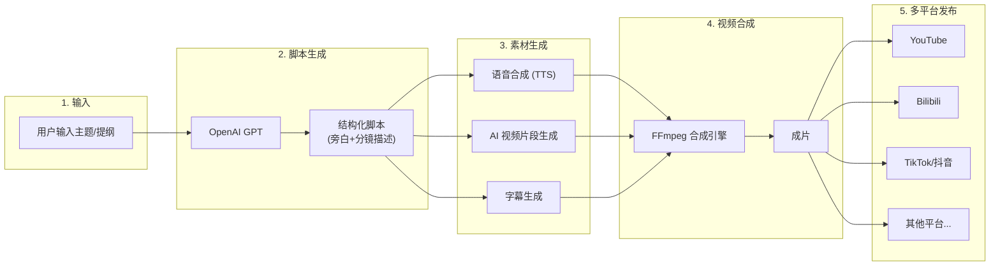

# AI 视频流水线 - 项目大纲

## 整体架构




## 技术栈

- **语言**: Python 3.11+ — AI 生态最成熟，库支持最广
- **CLI 框架**: Typer — 现代 CLI 框架，自动生成帮助文档
- **LLM**: OpenAI API (GPT-4o) — 脚本/分镜生成
- **TTS**: OpenAI TTS / edge-tts — 语音合成，edge-tts 免费备选
- **视频生成**: Runway ML / 可灵 API — 云端 AI 视频生成，设计为可插拔
- **视频处理**: FFmpeg (via python-ffmpeg) — 视频拼接、字幕烧录、格式转换
- **配置管理**: YAML + Pydantic — 类型安全的配置管理
- **任务编排**: asyncio — 异步并发处理多个生成任务
- **桌面端 (后期)**: Tauri v2 — 后续迭代加入 GUI

## 分阶段实施计划

### Phase 1 - 核心骨架 (MVP)

- 项目初始化：目录结构、依赖管理、配置系统
- 文本脚本生成模块：调用 OpenAI，将用户主题转为结构化分镜脚本（JSON 格式）
- CLI 基础命令：`generate-script`、`generate-video`、`publish`、`run`（全流程）

### Phase 2 - 素材生成

- TTS 语音合成模块（OpenAI TTS 优先，edge-tts 作免费备选）
- AI 视频片段生成模块（先对接一个 API，如 Runway）
- 字幕生成模块（基于脚本文本 + 音频时间轴）

### Phase 3 - 视频合成

- FFmpeg 合成引擎：将视频片段 + 音频 + 字幕合成为成片
- 多分辨率/比例适配（横屏 16:9、竖屏 9:16）
- 转场效果支持

### Phase 4 - 多平台发布

- YouTube 发布器（YouTube Data API v3，OAuth2 认证）
- Bilibili 发布器（bilibili-api 库）
- 通用发布器基类，方便扩展更多平台
- 发布状态追踪与重试机制

### Phase 5 - 增强与扩展

- 更多视频生成后端（可灵、Pika 等，可插拔切换）
- 批量任务支持（从 CSV/JSON 批量读取主题，批量生产）
- 任务持久化与断点续跑
- Tauri 桌面端 GUI

## 项目目录结构

```
ai-videopipeline/
├── src/
│   └── videopipeline/
│       ├── __init__.py
│       ├── cli.py                  # Typer CLI 入口
│       ├── config.py               # 配置加载与校验 (Pydantic)
│       ├── pipeline.py             # 流水线编排引擎
│       ├── models/
│       │   ├── __init__.py
│       │   └── script.py           # 脚本数据模型 (场景、旁白、分镜)
│       ├── generators/
│       │   ├── __init__.py
│       │   ├── text.py             # OpenAI 脚本生成
│       │   ├── video.py            # AI 视频生成 (可插拔后端)
│       │   ├── audio.py            # TTS 语音合成
│       │   └── subtitle.py         # 字幕生成
│       ├── assembler/
│       │   ├── __init__.py
│       │   └── composer.py         # FFmpeg 视频合成
│       ├── publishers/
│       │   ├── __init__.py
│       │   ├── base.py             # 发布器抽象基类
│       │   ├── youtube.py          # YouTube
│       │   └── bilibili.py         # Bilibili
│       └── utils/
│           ├── __init__.py
│           ├── ffmpeg.py           # FFmpeg 命令封装
│           └── storage.py          # 临时文件与产物管理
├── config/
│   └── default.yaml                # 默认配置模板
├── output/                         # 生成产物输出目录
├── pyproject.toml                  # 项目元数据与依赖
├── requirements.txt
└── README.md
```

## 核心数据流 - 脚本结构示例

LLM 生成的结构化脚本采用如下 JSON 格式，作为后续所有模块的输入契约：

```json
{
  "title": "视频标题",
  "description": "视频简介",
  "tags": ["标签1", "标签2"],
  "scenes": [
    {
      "scene_id": 1,
      "duration": 5.0,
      "narration": "这里是第一个场景的旁白文字",
      "visual_prompt": "A serene mountain landscape at sunrise, cinematic, 4K",
      "transition": "fade"
    },
    {
      "scene_id": 2,
      "duration": 4.0,
      "narration": "第二个场景的旁白",
      "visual_prompt": "Close-up of morning dew on green leaves, macro photography",
      "transition": "crossfade"
    }
  ]
}
```

## 关键设计原则

1. **可插拔架构** - 视频生成、TTS、发布器均设计为抽象基类 + 具体实现，后续增加新的 API 提供商只需实现接口
2. **配置驱动** - 所有 API 密钥、模型参数、输出规格均通过 YAML 配置文件管理，敏感信息走 `.env`
3. **幂等与可恢复** - 每个阶段的中间产物持久化到磁盘，流水线可以从任意阶段重跑，避免重复消耗 API 调用
4. **异步并发** - 多个场景的视频生成、TTS 可并行执行，缩短整体耗时

